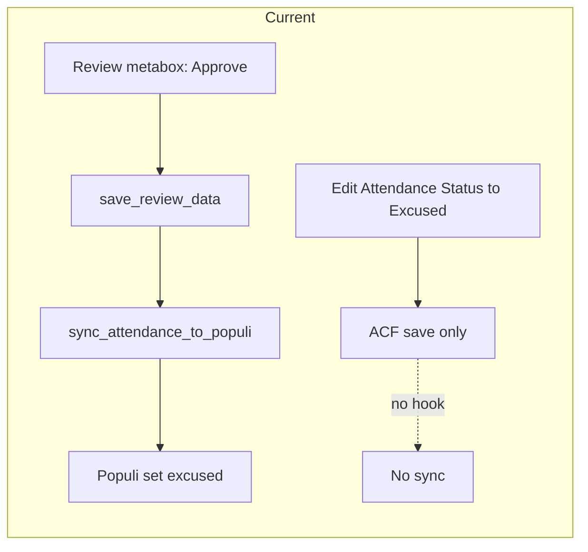
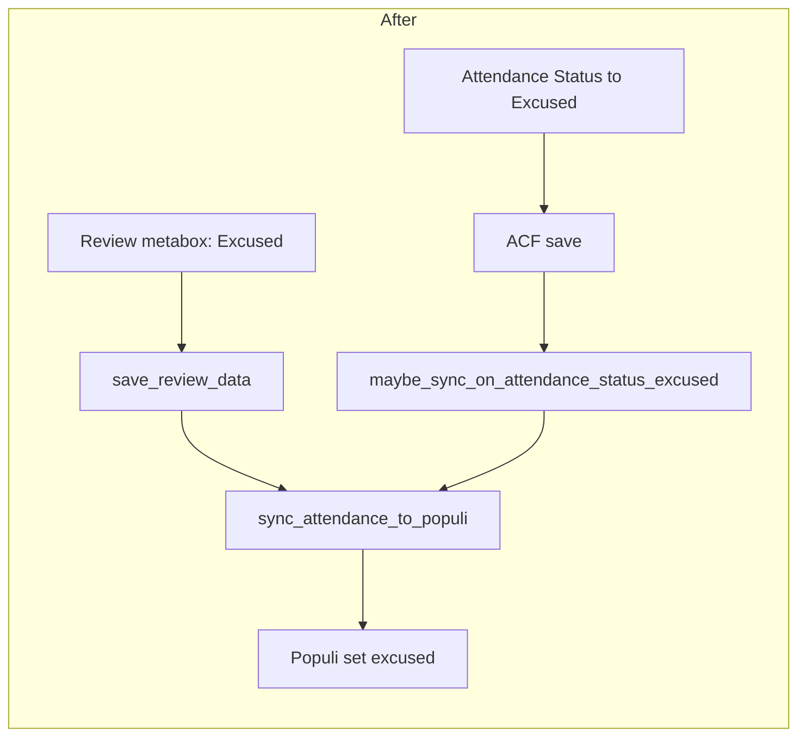

# Attendance Status → Excused Sync and Label Parity

## Current behavior

- **Review action "Approve"** (metabox) → calls `sync_attendance_to_populi()` → Populi updated to "excused".
- **Attendance Status** (Tardy/Absent/Excused dropdown) → save only updates post meta; no sync runs.

## 1. Sync to Populi when Attendance Status is set to Excused

**Goal:** When an admin (or any user who can edit the record) changes the **Attendance Status** field to **Excused** and saves, call the same Populi sync so the record is marked excused in Populi.

**Approach:** Add an `acf/save_post` handler in [class-populi-importer.php](wp-content/plugins/pbattend/includes/class-populi-importer.php) that runs after ACF saves. If the post is `pbattend_record` and the saved attendance status is `EXCUSED`, call `sync_attendance_to_populi($post_id)`.

**Implementation details:**

- In `PBAttend_Populi_Importer::__construct()`, add:
  - `add_action('acf/save_post', array($this, 'maybe_sync_on_attendance_status_excused'), 20);`
- Add a new method `maybe_sync_on_attendance_status_excused($post_id)`:
  - Return early if `get_post_type($post_id) !== 'pbattend_record'`.
  - Return early if not in admin (optional: could allow front-end if you ever expose that field there).
  - If `get_field('attendance_details_attendance_status', $post_id) !== 'EXCUSED'`, return.
  - Call `$this->sync_attendance_to_populi($post_id)` (same method used by the Review metabox). No need to change `sync_attendance_to_populi`; it already sends `'excused'` to the API.

This keeps all Populi sync logic in the importer and ensures both the Review "Approve" path and the direct Attendance Status → Excused path update Populi. Calling sync when the field is already Excused is safe (idempotent).

---

## 2. Rename "Approved"/"Approve" to "Excused" in the UI only

**Goal:** Show "Excused" everywhere we currently show "Approved" or "Approve" for the review workflow, so the wording matches Populi. **Internal value remains `approved**` so existing code (notifications, filters, meta queries, CSS classes) does not break.

**Files and changes:**

| File                                                                                            | Change                                                                                                                                                                                                                                                                                                                                                                                                                                               |
| ----------------------------------------------------------------------------------------------- | ---------------------------------------------------------------------------------------------------------------------------------------------------------------------------------------------------------------------------------------------------------------------------------------------------------------------------------------------------------------------------------------------------------------------------------------------------- |
| [class-acf-fields.php](wp-content/plugins/pbattend/includes/class-acf-fields.php)               | In the `review_status` field choices, change `'approved' => 'Approved'` to `'approved' => 'Excused'`.                                                                                                                                                                                                                                                                                                                                                |
| [class-post-types.php](wp-content/plugins/pbattend/includes/class-post-types.php)               | (1) In the Review metabox dropdown, change the option label from "Approve" to "Excused" (keep `value="approved"`). (2) In `render_review_metabox`, when displaying "Current Status", show "Excused" when `$current_status === 'approved'` instead of `ucfirst($current_status)`. (3) In `render_custom_columns` for `review_status`, when `$status === 'approved'` output "Excused", otherwise `ucfirst($status)` (with fallback for empty/pending). |
| [attendance-dashboard.php](wp-content/plugins/pbattend/page-templates/attendance-dashboard.php) | In the filter dropdown, change `<option value="approved">Approved</option>` to `<option value="approved">Excused</option>`. (Dashboard table label comes from ACF choices, so it will show "Excused" once ACF is updated.)                                                                                                                                                                                                                           |
| [attendance-editor.php](wp-content/plugins/pbattend/page-templates/attendance-editor.php)       | Where Review Status is displayed, use a small conditional: if `$review_status === 'approved'` echo "Excused", else `ucfirst($review_status)` (with "Pending" fallback).                                                                                                                                                                                                                                                                              |

**Optional:** In [class-notifications.php](wp-content/plugins/pbattend/includes/class-notifications.php), in the email sent when status changes to approved, change the wording to say "updated to Excused" instead of "updated to APPROVED" when `$new_status === 'approved'`.

**What not to change:**

- All comparisons and stored meta stay as `'approved'` (e.g. `$action === 'approved'`, `in_array($new_status, array('approved', 'rejected'))`, filter by `value="approved"`).
- CSS class `.status-approved` unchanged (still applied when `review_status` is `approved`).

---

## 3. Flow after implementation

- Both "Review action: Excused" and "Attendance Status: Excused" trigger the same sync to Populi.
- Everywhere in the UI the user sees "Excused" instead of "Approved"/"Approve"; backend value remains `approved`.

---

## 4. Testing suggestions

- Change an attendance record’s **Attendance Status** to **Excused** and save → confirm in logs that "Starting attendance sync to Populi" runs and Populi shows excused.
- Use the **Review** metabox to set action to **Excused** (label) and save → confirm sync still runs and Populi is updated.
- Confirm dashboard and editor show "Excused" for approved records, and filter by "Excused" still returns the same records.
- Confirm notifications and any existing behavior that depend on `review_status === 'approved'` still work.

